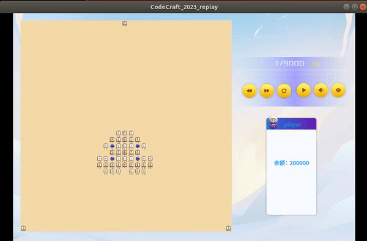
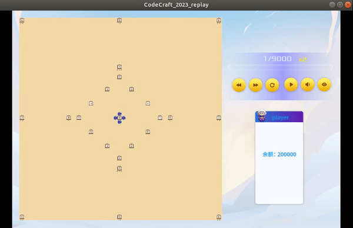

## 2023年华为软件精英挑战赛

### 结果演示

<!--  -->

### 任务简述

给定一定初始资金，每个控制台可生产商品种类和可出售商品种类，其中1，2，3为初始材料，4，5，6，7为加工商品，每个种类商品差价不同。通过操控四个机器人来进行购买和出售商品，来在给定时间内通过制定四个机器人的购买策略和防碰撞机制来赚取尽可能多的资金。

### 相关策略

- **机器人速度转速策略**：速度采用随与目标点角度增大而逐步衰减的策略，转速采用机器人的当前方向小于一定阈值为0，其他时候为最大的策略。
- **工作台选取策略**：使用贪心策略。初始化计算各个种类工作台卖各种物品可赚的差价，根据机器人当前位置和各个工作台距离，计算当前位置前往各工作台买卖各种物品所需帧数来得到最大每帧可赚取买卖工作台，选取作为当前机器人要前往买卖的工作台。
- **机器人防碰撞策略**：
   + 方法一：设定安全范围阈值，若多个机器人位置小于安全阈值，则根据两个机器人数帧后距离增大还是缩小判断是否会相撞，若距离缩小可能相撞，则根据机器人当前方向角来进行速度和转速调节避免相撞。
   + 方法二：使用dwa算法避免相撞。
- **机器人购买交换策略**：若一个机器人要购买，而另一个机器人出售掉当前携带商品且距离要购买的机器人选定的工作台更近，则使用交换策略交换两个机器人接下来买卖的目标点，以节约大量行走时间。
- **奖励策略**： 序号数越大商品可赚差价越多，但同时需要的原材料越多。为了在规定时间赚更多资金，需要通过奖励机制来使机器人更倾向于生产高差价商品。因此制定了相应奖励机制使机器人优先给**所缺材料更少**的工作台运送材料，以及给能**生产更高差价商品**的工作台优先运送材料。